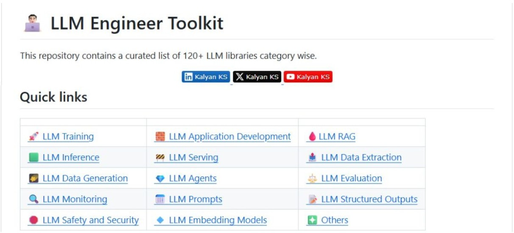

Authored by **Kalyan KS**. You can follow him on [Twitter](https://x.com/kalyan_kpl) and [LinkedIn](https://www.linkedin.com/in/kalyanksnlp/) for the latest LLM, RAG and Agent updates.

## 📌 Q115: What is the significance of self-supervised learning in LLM pretraining?

### ✅ Answer

Self-supervised learning (SSL) is crucial for LLM pretraining because it allows models to learn rich, general-purpose language representations from massive amounts of unlabeled text data. It works by creating a surrogate task, like predicting the next word, where the "labels" are automatically derived from the input itself. 

This eliminates the need for expensive human annotation. By predicting the next token in a sequence, the model learns syntax, semantics, and world knowledge from massive unlabeled corpora. 

## **👨🏻‍💻 LLM Engineer Toolkit**

🤖 This repository contains a curated list of 120+ LLM, RAG and Agent related libraries category wise. 

👉 [Repo link](https://github.com/KalyanKS-NLP/llm-engineer-toolkit) 

This repository is highly useful for Data Scientists, AI/ML Engineers working with LLMs, RAG and Agents.

 

---------------------------------------------------------------------------------------------

