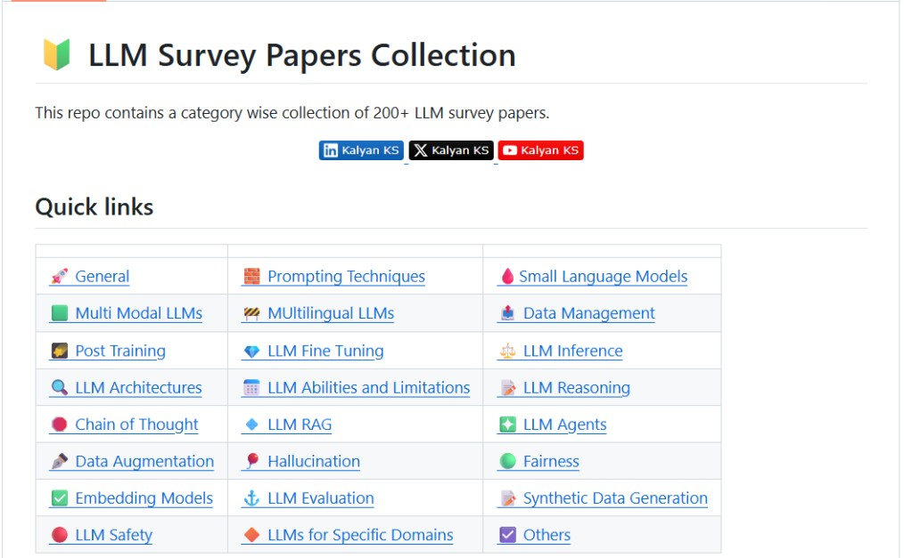

Authored by **Kalyan KS**. You can follow him on [Twitter](https://x.com/kalyan_kpl) and [LinkedIn](https://www.linkedin.com/in/kalyanksnlp/) for the latest LLM, RAG and Agent updates.

## 📌 Q40: Explain the trade-offs between batching and latency in LLM serving.

### ✅ Answer

Batching in LLM serving increases throughput by processing multiple requests concurrently, maximizing GPU utilization and efficiency, especially under heavy workloads. However, larger batches inevitably increase latency since faster or shorter requests must wait for the longest sequence to complete before the batch finishes. 

Continuous or dynamic batching strategies attempt to balance this by adjusting batches in real time, replacing completed requests with new ones to maintain efficiency while minimizing waiting time. Ultimately, the trade-off depends on application needs—interactive systems prioritize low latency, whereas industrial or offline jobs aim for higher throughput at some latency cost.

## 📌 Q41: How can techniques like mixture-of-experts (MoE) optimize inference efficiency?

### ✅ Answer

Mixture-of-Experts (MoE) optimizes inference efficiency by introducing conditional computation or sparsity. Instead of activating all model parameters for every input token, a lightweight gating network dynamically selects only a small subset of specialized "expert" sub-networks to process the token. 

This selective activation means the model performs significantly fewer floating-point operations (FLOPs) per token compared to a dense model of a comparable total size. This results in faster token generation (reduced latency) and higher throughput.

## 📌 Q42:Explain the role of decoding strategy in LLM text generation. 

### ✅ Answer

Decoding strategies in LLMs are the decision rules a model uses to choose the next token from its vocabulary when generating text. An LLM doesn't just "know" the next word; it calculates a probability for every single possible word it knows. The decoding strategy is simply the method used to select the final word from that list of probabilities to form the output text, one word at a time. 

The choice of strategy heavily influences whether the output is predictable and factual, or creative and diverse. Common decoding strategies include greedy search, beam search, and sampling methods like temperature scaling and top-k/top-p sampling.

## 👨🏻‍💻 LLM Survey Papers Collection

👉 [Repo Link](https://github.com/KalyanKS-NLP/LLM-Survey-Papers-Collection)

---------------------------------------------------------------------------------------------

