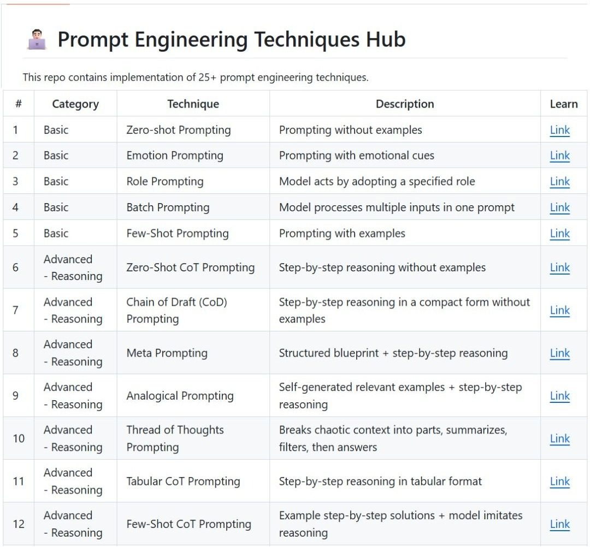

Authored by **Kalyan KS**. You can follow him on [Twitter](https://x.com/kalyan_kpl) and [LinkedIn](https://www.linkedin.com/in/kalyanksnlp/) for the latest LLM, RAG and Agent updates.

## 📌 Q85: Describe a strategy for reducing hallucinations via prompt design.

### ✅ Answer

A key strategy for reducing hallucinations in LLMs via prompt design is grounding the response by instructing the model to rely exclusively on provided context. This is often achieved by including a clear directive such as: "Answer the following question only using the provided document. If the document does not contain the answer, state 'The information is not available in the document.' Do not use any external knowledge." 

This constrains the model's search space to the provided input, significantly decreasing the likelihood of generating fabricated or incorrect details.

## 📌 Q86: How would you structure a prompt to ensure the LLM output is in a specific format, like JSON?

### ✅ Answer

To ensure an LLM output is in a specific format like JSON, you should include an explicit instruction in the prompt, clearly stating the desired output structure. For example, "Please respond with a valid JSON object." 

It is also helpful to provide a schema or example of the required JSON structure, including the keys and expected data types for each value.  Additionally, including an explicit instruction to only output the JSON and nothing else helps prevent explanation text from being included, resulting in a clean, parsable output.

## 📌 Q87: Explain the purpose of ReAct prompting in AI Agents.

### ✅ Answer

ReAct (Reasoning and Acting) prompting allows the agent to solve complex, multi-step tasks by allowing it to dynamically plan, execute external actions (e.g., using a search engine or tool), and refine its approach based on observations. 

This loop of thinking, acting, and observing keeps the model’s reasoning grounded in real-world feedback, which reduces hallucinations and makes its decisions more accurate, interpretable, and reliable. By combining logical reasoning with real-world interaction, ReAct enables more flexible, reliable, and human-like problem-solving.

## **👨🏻‍💻 Prompt Engineering Techniques Hub**

This GitHub repo includes implementations of must know 25+ prompt engineering techniques.

👉 [Repo link](https://github.com/KalyanKS-NLP/Prompt-Engineering-Techniques-Hub)

Knowledge of prompt engineering techniques is essential for Data Scientists, AI/ML Engineers working with LLMs, RAG and Agents. 

 

------------------------------------------------------------------------------------------

